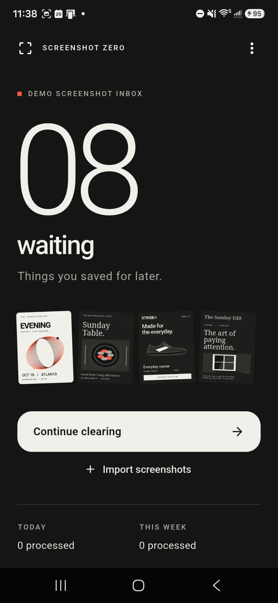
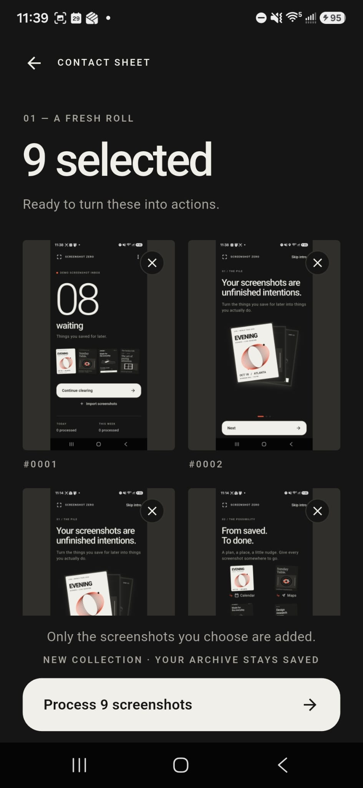
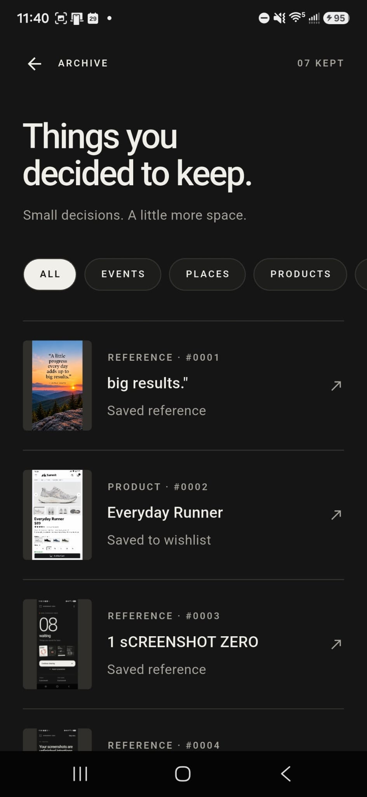
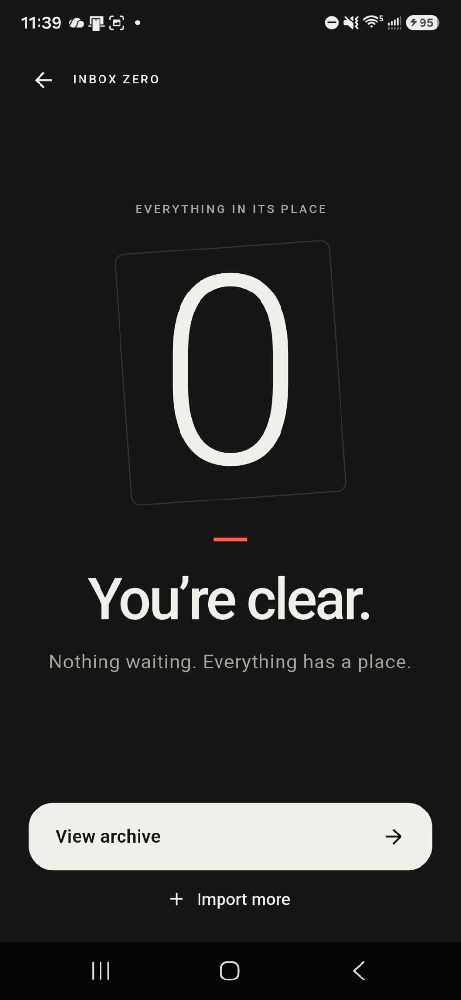
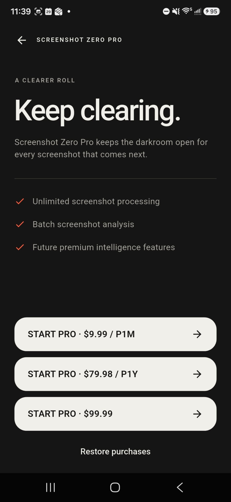
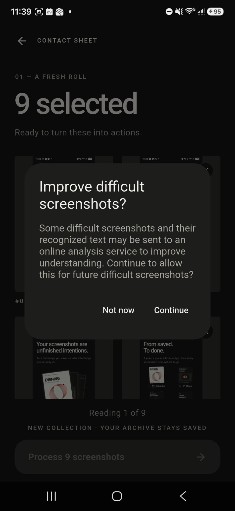
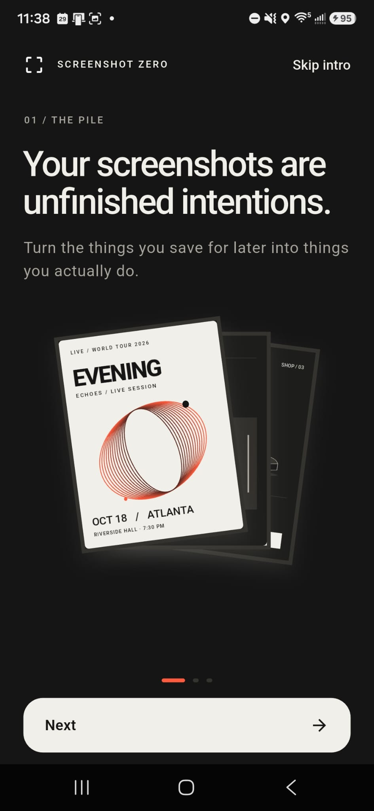
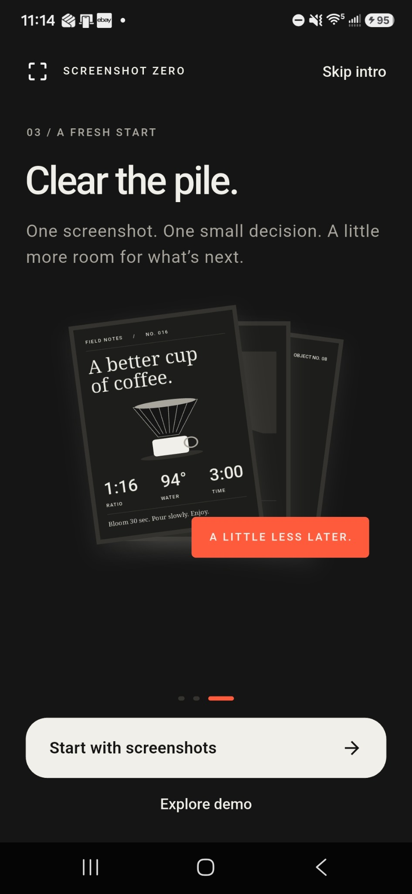
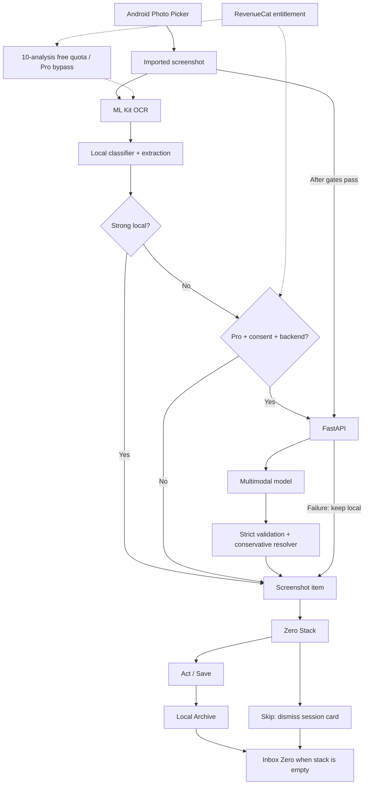

# Screenshot Zero

**Your screenshots are unfinished intentions.**

Screenshot Zero turns screenshot clutter into action. An event poster you meant
to add to your calendar. A restaurant you wanted to visit. A product worth
remembering. An assignment deadline buried in your camera roll.

Bring them into one actionable inbox, decide what happens next, and clear the pile.

**Import → Understand → Act / Save / Skip → Zero**

## Why Screenshot Zero?

Screenshots hold events to attend, places to visit, products to remember, articles
to read, tasks to complete and references worth keeping. Then they get buried in
the camera roll.

Screenshot Zero treats them like an inbox, with a clear next step and a restrained
Digital Darkroom interface that keeps your screenshots at the center.

## Product tour

These screenshots and the demo video were submitted on Devpost and are included
here for the repository's product presentation.

[Watch the demo on YouTube](https://www.youtube.com/watch?v=rZnx14GW3YI)

| Home | Import Preview | Archive |
| --- | --- | --- |
|  |  |  |

| Inbox Zero | Pro paywall | Cloud fallback consent |
| --- | --- | --- |
|  |  |  |

| Onboarding: the pile | Onboarding: a fresh start |
| --- | --- |
|  |  |

Home shows the deterministic demo inbox. Paywall prices reflect the captured
offering configuration, not a guarantee of current production pricing. Demo
actions are simulated; real imports use device integrations.

See the [submission checklist](docs/submission-checklist.md) for recorded
verification and remaining capture and distribution items.

## The experience

1. **Import** the screenshots you want to clear.
2. **Understand** their text, intent and useful details.
3. **Find a next step**, or keep the screenshot as a Reference.
4. **Act, Save or Skip** each card in the Zero Stack.
5. **Reach Inbox Zero** when the stack is empty.

## Supported intents

| Intent | Action |
| --- | --- |
| Event | Add to Calendar |
| Place | Open in Maps |
| Product | Add to Wishlist |
| Read | Save for Reading |
| Task | Create Reminder |
| Reference | Save Reference |

Calendar opens for the user to save the event and confirm the outcome. Reminders
require a confirmed time. Reading items can open an actually detected URL.

## Built around action, not AI

Screenshot Zero asks: **What did you save this to do?** Recognition is useful when
it helps you take the next step.

These controlled examples were verified during development:

| Screenshot | Extracted details | Next step |
| --- | --- | --- |
| Campus Research Symposium | Oct 18, 2026 · 7:30 PM · Student Center Ballroom | Add to Calendar |
| Everyday Runner | $89 · Chalk · Size 9 | Add to Wishlist |
| Assignment 3 | Due Sep 30, 2026 · 11:59 PM · CSC 6851 | Create Reminder |
| Sunday Table | 48 Peachtree Street, Atlanta | Open in Maps |

Reference is a valid outcome. Recognizing food or shoes alone does not establish
a shopping task or another actionable intent.

## Inbox Zero

Every screenshot has three possible outcomes:

| Choice | What happens |
| --- | --- |
| **Act** | Perform its primary action and archive the outcome. |
| **Save** | Archive it without performing the primary action. |
| **Skip** | Dismiss it from the current clearing session only. |

Skip never creates a false Archive entry. Original screenshots are never
automatically deleted.

> Clear the stack. Reach zero.

## An Archive worth coming back to

Keep the screenshots you want, together with their extracted details and action
status. The persistent local Archive preserves app-owned copies of the original
imported images. No account is required, and there is no cloud Archive sync.

Copies preserve original bytes and EXIF metadata. Versioned JSON records and
content-addressed image storage provide deduplication; a corrupt record is skipped
without wiping the collection. This approach supports hundreds of records without
introducing a database before complex queries are needed.

## Local-first intelligence

**The fast path stays on your device.** ML Kit reads the screenshot; deterministic
classification and structured extraction turn its text into useful details.
Confident local results never upload. Reference title cleanup rejects
low-information OCR without guessing an unseen subject from a brand name.

**The fallback helps with weak or uncertain results.** It requires Pro, explicit
saved consent and a configured backend. Only then can the selected screenshot and
OCR/context go to FastAPI for OpenAI multimodal analysis. Strict validation and a
conservative resolver check the response; failures preserve the local result.

Visual recognition alone does not force an Event, Place, Product or Task.
Ambiguous content can remain Reference.

## Screenshot Zero Pro

Powered by RevenueCat.

| Free | Pro |
| --- | --- |
| 10 real screenshot analyses | Removes the app-side processing quota |
| Local OCR and extraction | Also unlocks optional multimodal fallback |

Purchase and restore are supported, with prices from RevenueCat offerings.
Entitlement `screenshot_zero_pro` is shared across startup refresh, purchase,
restore, the entitlement listener and paywall. Demo items consume no quota.

Fallback still requires consent and backend availability, and remains subject to
backend rate/cost limits. RevenueCat Test Store is **debug-only**: release builds
must not use `test_` keys and need the Android production key for purchases.

## Privacy by design

- OCR runs locally, and strong local results never upload.
- Cloud fallback requires consent and sends only selected difficult screenshots.
- There is no background gallery scanning or automatic original deletion.
- No user accounts or cloud Archive are required or provided.
- The backend does not permanently archive screenshots; upstream retention
  policies still apply.
- Release builds hide diagnostics and internal errors.

Calendar and Maps receive the action data you choose to use. RevenueCat handles
subscription communication. OpenAI credentials stay on the backend.

## Completed development verification

These recorded checks cover development builds; published media do not establish
production distribution readiness.

Development testing covered a physical Android device, Android Photo Picker,
OCR, real Calendar and Maps actions, reminders, persistent Archive and RevenueCat
Test Store.

Phone-to-FastAPI connectivity and live multimodal inference, including semantic
Reference results, were verified with a debug APK, USB debugging, `adb reverse`
and the backend on `127.0.0.1:8000`. This does not imply exhaustive device coverage,
production security validation or perfect model accuracy.

## Architecture



Riverpod coordinates the inbox, Archive, quota and subscriptions.

## Tech stack

| Layer | Tools |
| --- | --- |
| Mobile | Flutter, Dart, Riverpod, GoRouter, ML Kit, RevenueCat, SharedPreferences, flutter_local_notifications |
| Backend | Python, FastAPI, official OpenAI SDK, Pydantic |
| Storage | Versioned JSON records, app-owned images, content hashing and deduplication |

## Setup

Flutter 3.47.4 / Dart 3.13.3, Java 17, Android SDK 36 (minimum 24).
Version **1.5.0+6**, package `com.screenshotzero.screenshot_zero`.

```powershell
flutter pub get
flutter run -d DEVICE_ID --dart-define=REVENUECAT_API_KEY=YOUR_TEST_STORE_KEY

# Debug: Test Store and optional local backend
powershell -NoProfile -ExecutionPolicy Bypass -File .\tool\build_debug.ps1 `
  -RevenueCatApiKey "YOUR_TEST_STORE_KEY" `
  -MultimodalApiBaseUrl "http://127.0.0.1:8000"

# Safe release preview: no Test Store key or cloud endpoint
powershell -NoProfile -ExecutionPolicy Bypass -File .\tool\build_release.ps1
```

Flutter reads `REVENUECAT_API_KEY` and `MULTIMODAL_API_BASE_URL` through
`String.fromEnvironment`; it does not automatically load `.env.example`.
APKs are in `build/app/outputs/flutter-apk/`. Current signing is for development
sideloading. Production requires distribution signing, an Android RevenueCat
production key and an HTTPS backend if enabled.

### Backend setup

The [backend guide](backend/README.md) covers setup, the API contract and USB/LAN
phone connections. `OPENAI_API_KEY` and `OPENAI_MULTIMODAL_MODEL` belong only in
ignored `backend/.env`. For the debug APK's loopback endpoint, keep the backend
running, connect an authorized phone by USB and run:

```powershell
adb reverse tcp:8000 tcp:8000
```

## Demo

Explore the full loop with an **offline, deterministic eight-card demo** covering
all six categories. No Gallery, backend, OpenAI or RevenueCat network availability
is needed. Demo actions are simulated; real imports use actual device integrations.
Resetting the demo never clears your real Archive.

Debug builds retain OCR diagnostics and a confirmed **Clear development archive**
control in Home's menu. It clears only app-owned Archive records/images, leaving
originals, quota and scheduled reminders intact.

**[Watch the submitted demo video on YouTube](https://www.youtube.com/watch?v=rZnx14GW3YI).**

[90–150 second demo script](docs/demo-script.md) ·
[Submission checklist](docs/submission-checklist.md) ·
[Final polish results and regression phone checks](docs/final-polish.md)

## Testing

Latest verified results: **114 Flutter tests passing** and **22 backend tests passing**.

```powershell
flutter analyze
flutter test
cd backend
.\.venv\Scripts\python.exe -m pytest tests -q -p no:cacheprovider
```

## Known limitations

- OCR is English-oriented; visual models can produce uncertain titles or categories.
  Missing or incorrect EXIF cannot be reliably repaired by guessing.
- Android can delay reminders.
- No account sync, cloud Archive, Archive search or production deletion UI.
  Browser Archive and unprocessed inbox cards are session-only.
- Retry disk-write failures before closing. Uninstalling or clearing app data
  removes local records.
- Public deployment still requires production backend hardening, distribution
  signing, broader device/model-quality testing and asset-rights review.
  Use synthetic content; never publish a private Archive.

> Screenshot Zero turns the screenshots you meant to come back to into things you can actually finish.

## License

[MIT](LICENSE) — Copyright (c) 2026 Muhammad Mustufa.
