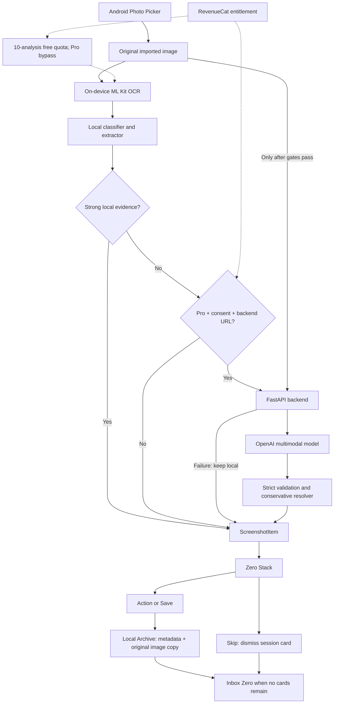

# Screenshot Zero

**Your screenshots are unfinished intentions.**

Screenshot Zero is a Flutter Android app that turns saved screenshots into useful
actions and a persistent Archive. Local-first OCR, optional multimodal understanding
and RevenueCat Pro help you clear the pile in a restrained Digital Darkroom interface.

## What it does

**Import → Understand → Act / Save / Skip → Zero**

Save something useful, act when you're ready, or skip it without deleting the
original. An offline deterministic demo and public setup instructions make the
six-intent workflow easy to explore.

## Product tour

Clean product captures are being prepared. Planned images (not linked until added):

| Screen | Capture to add |
| --- | --- |
| Home | `docs/images/home.png` |
| Zero Stack | `docs/images/zero-stack.png` |
| Archive | `docs/images/archive.png` |
| Pro paywall | `docs/images/pro-paywall.png` |

See the [capture checklist](docs/submission-checklist.md) for the complete set.

## Supported intents

| Category | Action |
| --- | --- |
| Event | Open Calendar, then confirm it was saved |
| Place | Open Maps |
| Product | Save to wishlist |
| Read | Save for reading; open an actually detected URL |
| Task | Confirm and schedule a reminder |
| Reference | Keep something useful without inventing an action |

Save archives without running the primary action. Skip dismisses only the current
session card; it never deletes the original or creates a false Archive status.
Reference is a valid outcome: a food photo is not automatically a shopping task.

## How it works

ML Kit OCR and existing classifier/extraction run on-device. Confident results
never upload. Weak results may use visual analysis only with Pro, saved consent
and a configured backend. Strict validation and a conservative resolver preserve
local results on failure. Reference title cleanup rejects low-information OCR;
it does not guess an unseen subject from a brand name.

Local OCR never uploads images. Optional visual analysis sends only selected
difficult screenshots and OCR/context after consent. The backend keeps no permanent
image archive; upstream retention policies still apply. Calendar/Maps receive chosen
action data. No background gallery scanning or automatic original deletion.

Physical Android multimodal connectivity and live inference, including semantic
Reference results, were verified in development using a debug APK, USB debugging,
`adb reverse` and the backend on `127.0.0.1:8000`. This is not exhaustive production
validation; broad model-quality evaluation remains future work.

## Architecture



Riverpod coordinates inbox, Archive, quota and subscriptions. Archive uses versioned
JSON records and content-addressed images in app support storage. Copies preserve
original bytes and EXIF metadata. Corruption skips individual records without
wiping the collection. This remains appropriate for hundreds of records; a database
migration adds risk without a present need for complex queries.

## RevenueCat / Pro

RevenueCat is integrated with entitlement `screenshot_zero_pro` across startup
refresh, purchase, restore, listener and paywall. Prices come from offerings.
Free includes **10 real screenshot analyses**. Pro removes the app's processing
quota and unlocks the premium fallback path, subject to consent, backend availability
and backend rate/cost limits. Demo cards consume no quota.

Test Store is used in debug development only. Release builds must not use `test_`
keys; they need the Android production key for purchases.

## Setup

Flutter 3.47.4 / Dart 3.13.3, Java 17, Android SDK 36 (minimum 24).
Version **1.5.0+6**, package `com.screenshotzero.screenshot_zero`.

```powershell
flutter pub get
flutter run -d DEVICE_ID --dart-define=REVENUECAT_API_KEY=YOUR_TEST_STORE_KEY

# Debug: Test Store and optional local backend
powershell -NoProfile -ExecutionPolicy Bypass -File .\tool\build_debug.ps1 `
  -RevenueCatApiKey "YOUR_TEST_STORE_KEY" `
  -MultimodalApiBaseUrl "http://127.0.0.1:8000"

# Safe release preview: no Test Store key or cloud endpoint
powershell -NoProfile -ExecutionPolicy Bypass -File .\tool\build_release.ps1
```

Flutter reads REVENUECAT_API_KEY and MULTIMODAL_API_BASE_URL through
String.fromEnvironment; it does not automatically load .env.example.
APKs are in build/app/outputs/flutter-apk/. Current signing is for development
sideloading. Production requires distribution signing, an Android RevenueCat
production key and HTTPS backend if enabled. Test Store is debug-only.

## Backend setup

[Backend setup, API contract and USB/LAN phone connection](backend/README.md)
documents FastAPI and the official OpenAI SDK. OPENAI_API_KEY and
OPENAI_MULTIMODAL_MODEL belong only in ignored backend/.env. For the debug APK's
loopback endpoint, connect an authorized phone by USB and run:

```powershell
adb reverse tcp:8000 tcp:8000
```

Release hides diagnostics and internal errors. Debug retains OCR diagnostics and a
confirmed **Clear development archive** control in Home's menu. This clears app-owned
Archive records/images only, not originals, quota or scheduled reminders.

## Demo

The deterministic eight-card demo covers all six categories without Gallery,
backend, OpenAI or RevenueCat network availability. Demo actions are simulated;
real imports invoke device integrations. Demo reset never clears real Archive.

[90–150 second demo script](docs/demo-script.md) ·
[Submission checklist](docs/submission-checklist.md)

## Testing

```powershell
flutter analyze
flutter test
cd backend
.\.venv\Scripts\python.exe -m pytest tests -q -p no:cacheprovider
```

[Final polish results and regression phone checks](docs/final-polish.md)

## Known limitations

English-oriented OCR and uncertain visual models. Verified development inference
does not guarantee every title/category. Missing/incorrect EXIF cannot be repaired reliably by guessing.
Browser Archive and unprocessed inbox cards are session-only. Android can delay
reminders. Disk-write failures require retry before closing; uninstall/clear-data
removes local records. No search, sync or production deletion UI.

Public deployment still requires asset-rights review, broader device/model-quality
testing, production security and distribution signing. Use synthetic content;
never publish a private Archive.

## License

[MIT](LICENSE) — Copyright (c) 2026 Muhammad Mustufa.
