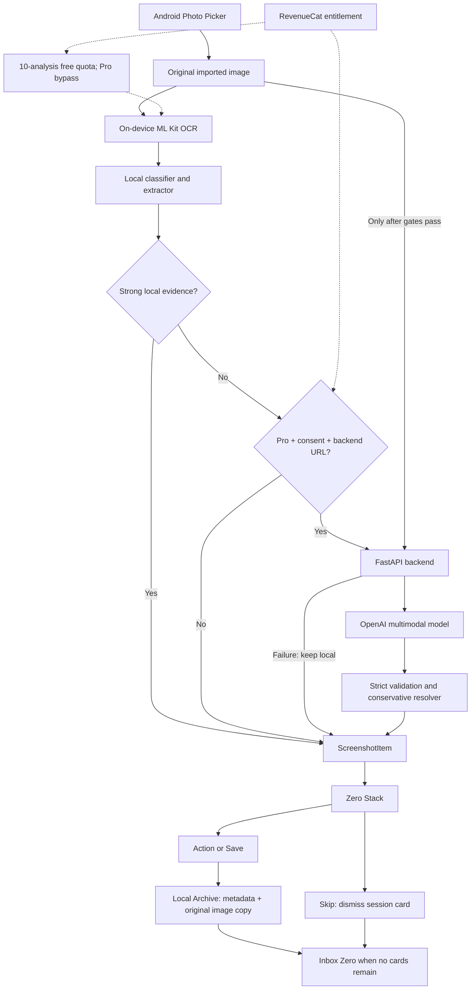

# Screenshot Zero

**Your screenshots are unfinished intentions.**

We save screenshots because we intend to do something with them. Screenshot Zero
turns that pile into a clearing session: **Import → Understand → Act / Save / Skip
→ Archive → Zero**, in a restrained Digital Darkroom interface.

| Category | Action |
| --- | --- |
| Event | Open Calendar, then confirm it was saved |
| Place | Open Maps |
| Product | Save to wishlist |
| Read | Save for reading; open an actually detected URL |
| Task | Confirm and schedule a reminder |
| Reference | Keep something useful without inventing an action |

Save archives without running the primary action. Skip dismisses only the current
session card; it never deletes the original or creates a false Archive status.
Reference is a valid outcome: a food photo is not automatically a shopping task.

## Local-first intelligence and architecture

ML Kit OCR and existing classifier/extraction run on-device. Confident results
never upload. Weak results may use visual analysis only with Pro, saved consent
and a configured backend. Strict validation and a conservative resolver preserve
local results on failure. Reference title cleanup rejects low-information OCR;
it does not guess an unseen subject from a brand name.



Riverpod coordinates inbox, Archive, quota and subscriptions. Archive uses versioned
JSON records and content-addressed images in app support storage. Copies preserve
original bytes and EXIF metadata. Corruption skips individual records without
wiping the collection. This remains appropriate for hundreds of records; a database
migration adds risk without a present need for complex queries.

## Setup and builds

Flutter 3.47.4 / Dart 3.13.3, Java 17, Android SDK 36 (minimum 24).
Version **1.5.0+6**, package `com.screenshotzero.screenshot_zero`.

```powershell
flutter pub get
flutter run -d DEVICE_ID --dart-define=REVENUECAT_API_KEY=YOUR_TEST_STORE_KEY

# Debug: Test Store and optional local backend
powershell -NoProfile -ExecutionPolicy Bypass -File .\tool\build_debug.ps1 `
  -RevenueCatApiKey "YOUR_TEST_STORE_KEY" `
  -MultimodalApiBaseUrl "http://127.0.0.1:8000"

# Safe release preview: no Test Store key or cloud endpoint
powershell -NoProfile -ExecutionPolicy Bypass -File .\tool\build_release.ps1
```

Flutter reads REVENUECAT_API_KEY and MULTIMODAL_API_BASE_URL through
String.fromEnvironment; it does not automatically load .env.example.
APKs are in build/app/outputs/flutter-apk/. Current signing is for development
sideloading. Production requires distribution signing, an Android RevenueCat
production key and HTTPS backend if enabled. Test Store is debug-only.

RevenueCat entitlement `screenshot_zero_pro` is shared by startup refresh,
purchase, restore, listener and paywall. Prices come from offerings. Pro bypasses
the existing 10-analysis allowance; demo cards consume none.

## Backend and privacy

[Backend setup, API contract and USB/LAN phone connection](backend/README.md)
documents FastAPI and the official OpenAI SDK. OPENAI_API_KEY and
OPENAI_MULTIMODAL_MODEL belong only in ignored backend/.env. For the debug APK's
loopback endpoint, connect an authorized phone by USB and run:

```powershell
adb reverse tcp:8000 tcp:8000
```

Local OCR never uploads images. Optional visual analysis sends selected difficult
screenshots and OCR/context after consent. The backend keeps no permanent image
archive; upstream provider retention policies still apply. RevenueCat communicates
for subscriptions. Calendar/Maps receive chosen action data. No gallery scanning,
automatic original deletion, accounts or cloud Archive sync.

Release hides diagnostics and internal errors. Debug retains OCR diagnostics and a
confirmed **Clear development archive** control in Home's menu. This clears app-owned
Archive records/images only, not originals, quota or scheduled reminders.

## Demo and testing

The deterministic eight-card demo covers all six categories without Gallery,
backend, OpenAI or RevenueCat network availability. Demo actions are simulated;
real imports invoke device integrations. Demo reset never clears real Archive.

```powershell
flutter analyze
flutter test
cd backend
.\.venv\Scripts\python.exe -m pytest tests -q -p no:cacheprovider
```

- [90–150 second demo script](docs/demo-script.md)
- [Submission and capture checklist](docs/submission-checklist.md)
- [Final polish results and exact phone checks](docs/final-polish.md)

## Known limits

English-oriented OCR; uncertain visual models; physical end-to-end visual testing
still required. Missing/incorrect EXIF cannot be repaired reliably by guessing.
Browser Archive and unprocessed inbox cards are session-only. Android can delay
reminders. Disk-write failures require retry before closing; uninstall/clear-data
removes local records. No search, sync or production deletion UI.

Public release still requires an owner-selected LICENSE, asset-rights review,
phone validation and production signing/deployment. No license was chosen on the
owner's behalf. Use synthetic content; never publish a private Archive.
